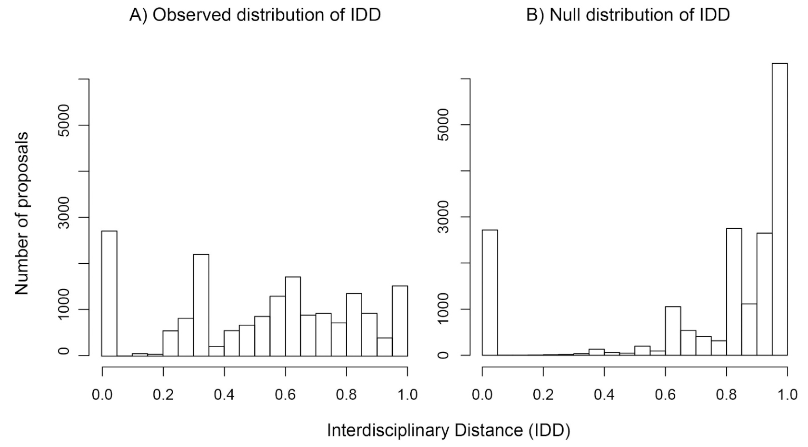
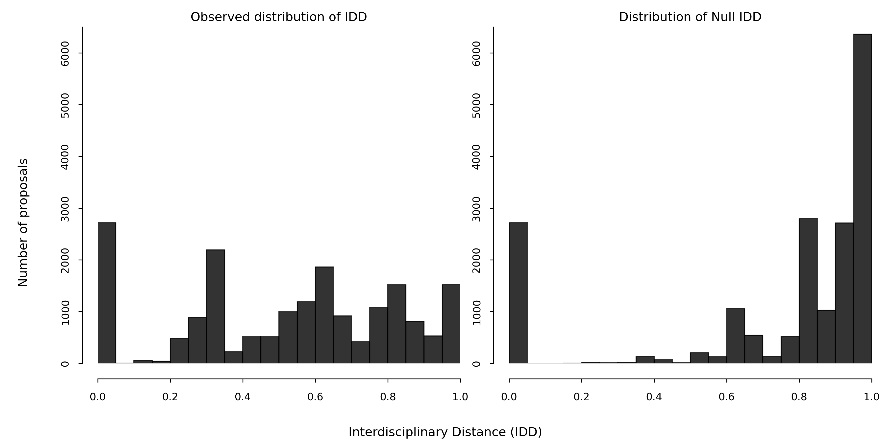
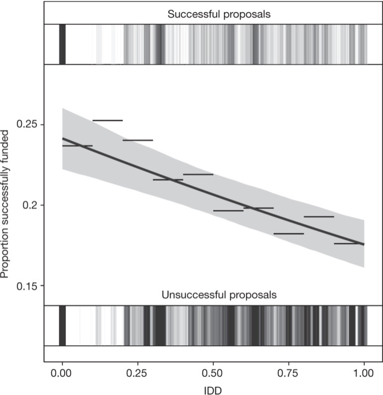
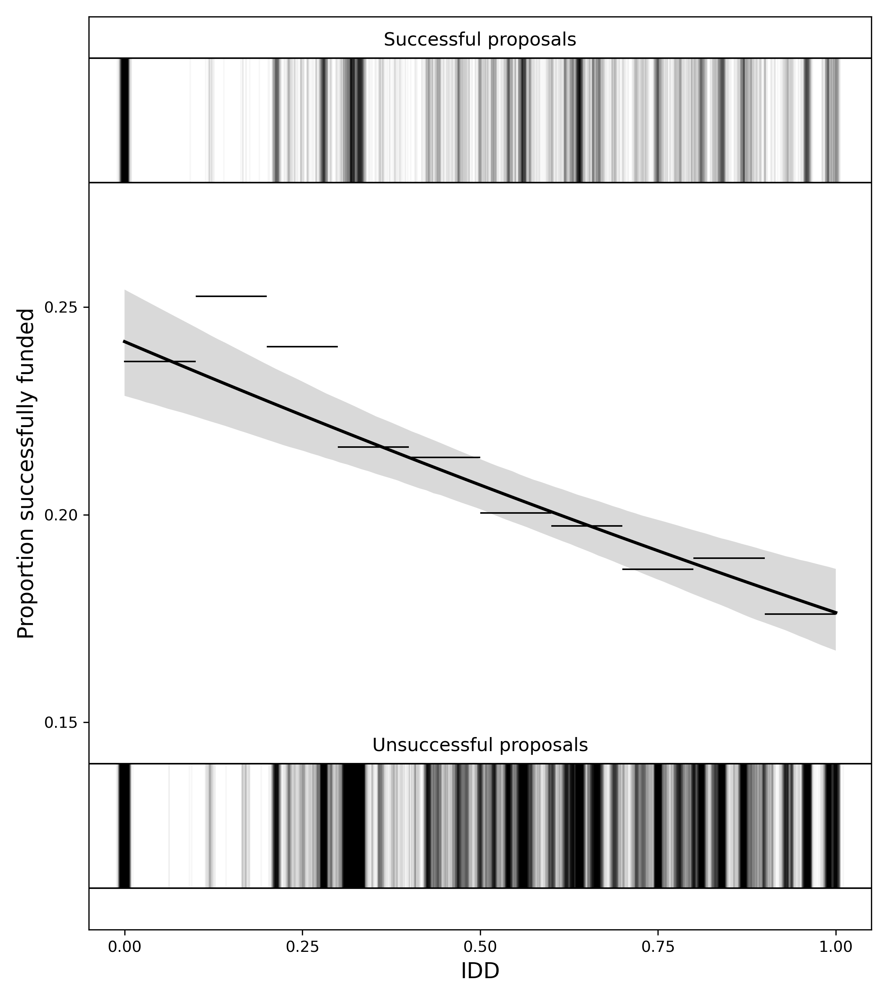
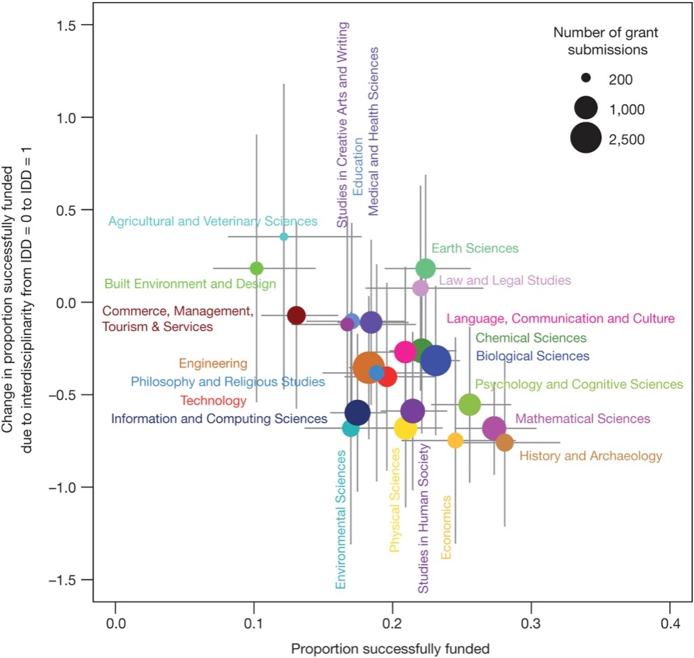
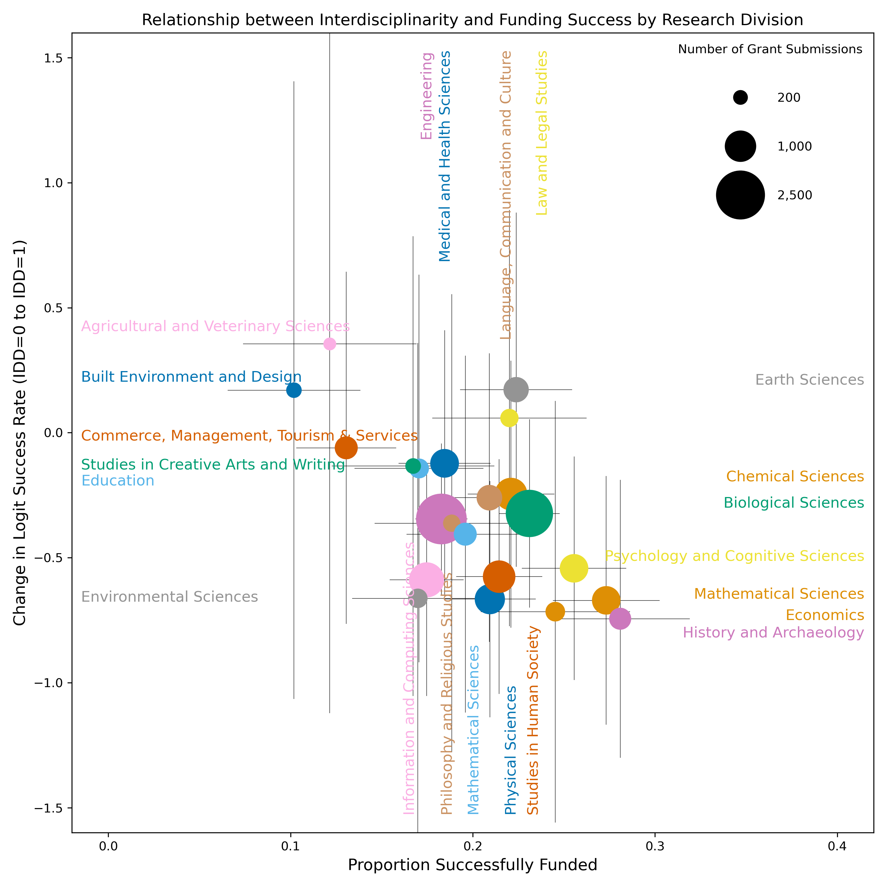

# Data Analysis - Funding Interdisciplinary Research Reproduction

This project aims to reproduce key findings from a Nature paper [Interdisciplinary research has consistently lower funding success](https://www.nature.com/articles/nature18315) on the relationship between interdisciplinarity and funding success. The analysis is based on the provided data and utilizes Python scripts for data processing and visualization.

## Reproduction Comparisons

Below are comparisons between the original figures from the original paper and the reproduced plots generated by `plot.ipynb`.

### Comparison 1: Observed IDD Distribution and Null IDD Distribution

Here we compare the distribution of the Interdisciplinary Distance (IDD) for observed proposals.

  <b>Original Figure</b> | <b>Reproduced Figure</b>
   
  
  &nbsp; &nbsp; &nbsp;
  

### Comparison 2:  Relationship between funding success and IDD score

This figure shows the overall trend in funding success probability as interdisciplinarity (IDD) increases.

  <b>Original Figure</b> | <b>Reproduced Figure</b>
   
  
  &nbsp; &nbsp; &nbsp;
  

### Comparison 3: Interdisciplinarity and Funding Success by Research Division

This comparison shows the relationship between a proposal's interdisciplinarity (IDD) and its funding success rate across different research divisions.

  <b>Original Figure</b> | <b>Reproduced Figure</b>
   
  
  &nbsp; &nbsp; &nbsp;
  

**Explanation of Potential Differences:**
1.  The observed IDD values themselves might differ slightly from the paper's due to approximations in the PSE calculation based on the FOR hierarchy. This difference in the underlying IDD values can lead to variations in the fitted trend and confidence intervals.
2.  For Comparison 3, the estimated effects and error bars are derived from a GLM implemented for ease in Python. The paper used a GLMM, and importantly, included covariates like number of investigators that are missing from this reproduction's data. This lack of covariates and the difference in model type contribute to variations in the estimated effects.
3.  Due to limitations in the available data, other analyses and figures presented in the original paper cannot be fully reproduced in this project.

## How to Use

Simly run all cells in `plot.ipynb`.

